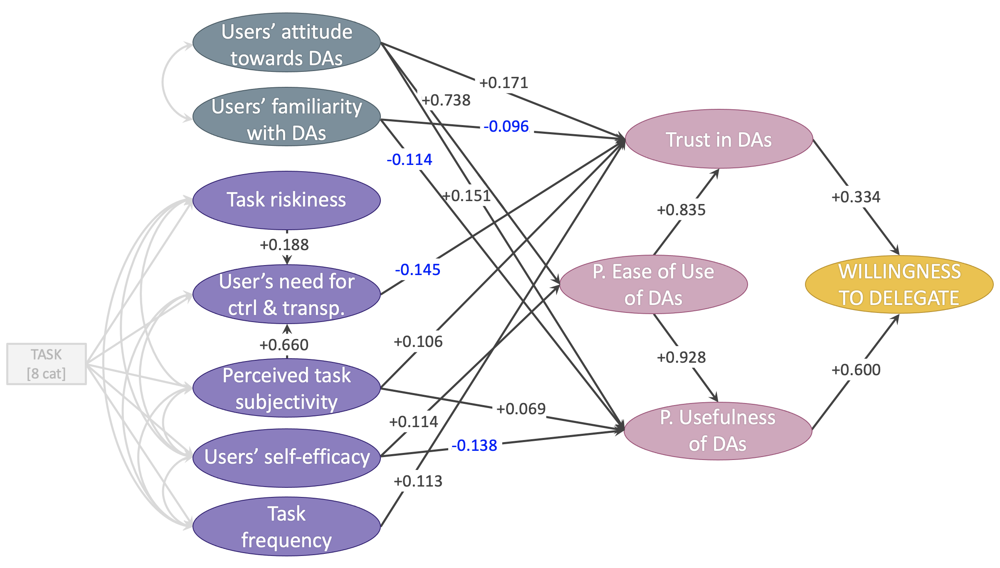
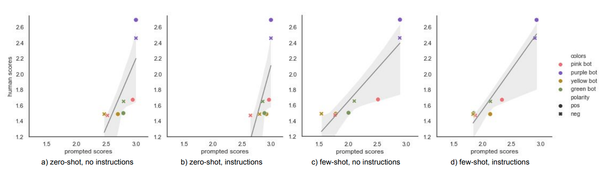
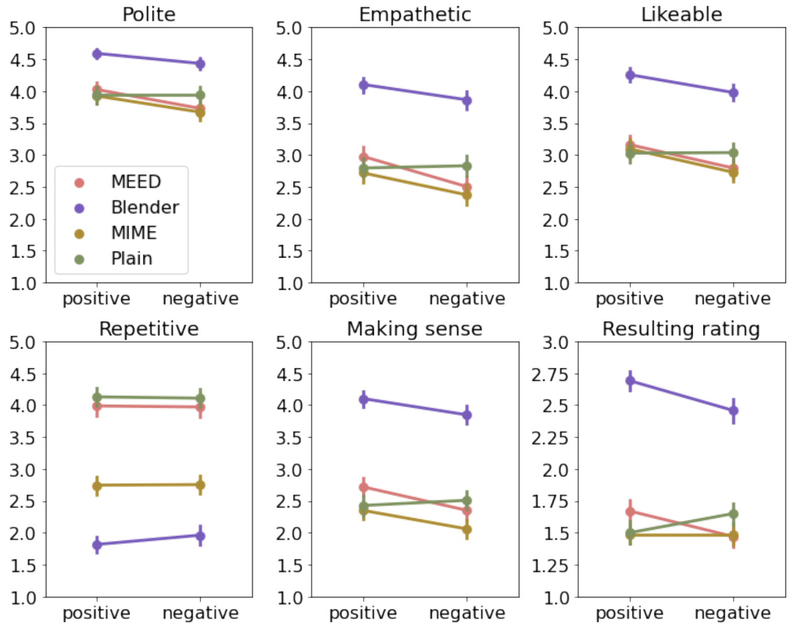
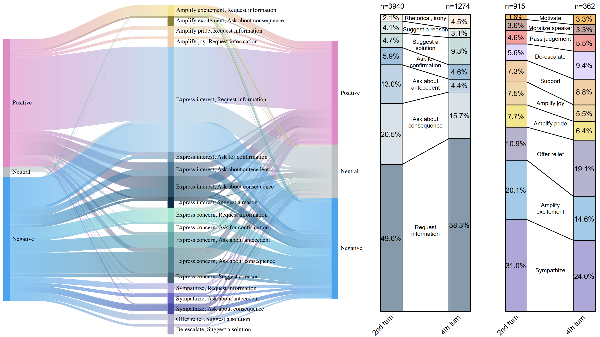
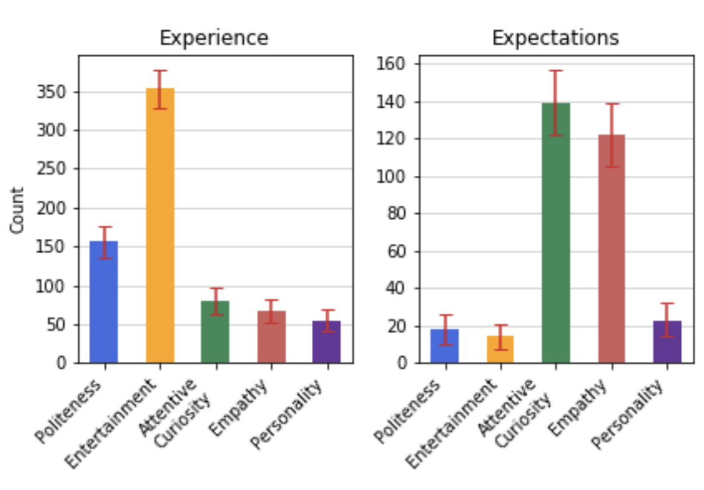
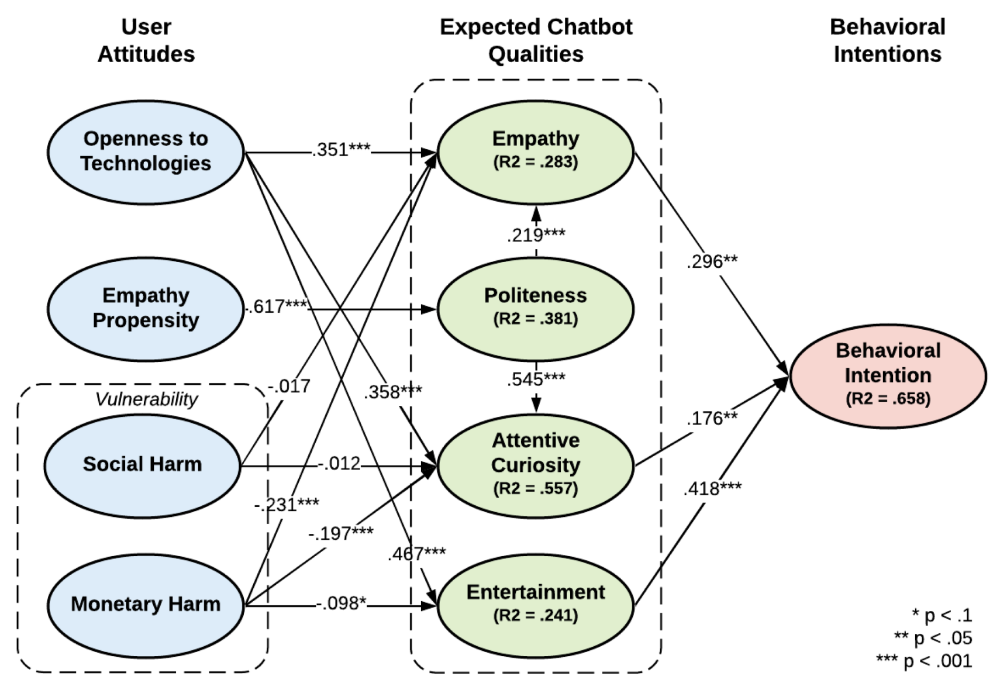
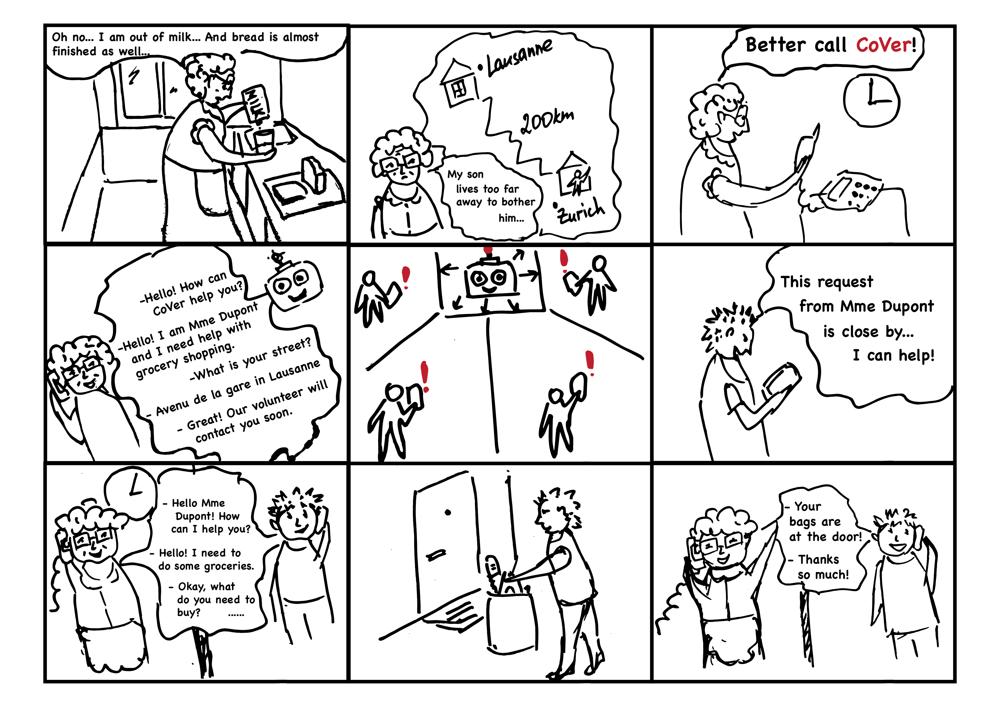

# About me
I am a researcher with broad interets in human-computer interaction and artificial intelligence. I earned my master’s and bachelor’s degrees in applied mathematics and physics at [MIPT](https://mipt.ru/english/). Currently, I am pursuing a doctorate in computer science at [EPFL](https://www.epfl.ch/en/), where I work with [Pearl Pu](https://www.epfl.ch/labs/gr-pu/members/pearl-pu/), studying social conversational agents, also known as chatbots.

My research focuses on understanding what qualities make chatbots compelling to users, and how to evaluate them. To achieve this, I approach my work from a user-centered perspective, with a focus on theoretical conceptualization, experimental design, and evaluation. Thanks to my interdisciplinary background, I have a unique set of skills that allows me to collaborate effectively with professionals from various fields.

# Research and Projects Summary
## Expectation vs Reality in Users’ Willingness to Delegate to Digital Assistants

  

Keywords: SEM, survey, digital assistant, willingness to delegate, trust, technology adoption, expectations

Publication: [CHI'2023](https://dl.acm.org/doi/10.1145/3544549.3585763)

Talk: [https://youtu.be/Lgk2bBXRnsQ](https://youtu.be/Lgk2bBXRnsQ)

We investigated drivers of willingness to use Digital Assistants (DAs) to complete various tasks. Drawing on related research on technology adoption, decision delegation, and automation, we conceptualized a model comprising key determinants of willingness to delegate, focusing on infuenceable factors for practitioners. This model includes users’ perceptions of different tasks, of DAs, and of their value (specifcally trust, ease of use, and usefulness). Our psychometric evaluation procedure confrmed the validity and reliability of the constructs in our model and verifed that the paths between them represented meaningful relationships. We interpreted these findings in light of related work and derive implications for practitioners.

## Approximating Human Evaluation of Social Chatbots with Prompting

  

Keywords: prompting, LLM, GPT, online interactive evaluation, chatbots, calibration

Preprint: [arXiv'2023](https://arxiv.org/abs/2304.05253)

The project addresses the need for scalable and robust evaluation metrics for conversational chatbots, as existing automatic evaluation metrics often focus on objective quality measures and disregard subjective perceptions of social dimensions. We proposed a framework that uses large language models (LLMs) from the GPT-family to collect synthetic chat logs of evaluated bots and conducts dialog system evaluation with prompting. The framework achieves full automation of the evaluation pipeline and shows impressive correlation with human judgement. The best-performing prompts include few-shot demonstrations and instructions, demonstrating the ability to generalize to other dialog corpora.

## iEval: Interactive Evaluation Framework for Open-Domain Empathetic Chatbots

  

Keywords: interactive human evaluation, empathetic chatbots, ANOVA, interaction effects, discourse analysis 

Publication: [SIGDIAL'2022](https://aclanthology.org/2022.sigdial-1.41/)

Talk: [https://youtu.be/WHxqN4MgvAA](https://youtu.be/WHxqN4MgvAA)

In this project, we proposed an interactive human evaluation framework called iEval, which measures the performance of open-domain empathetic chatbots. iEval framework provides high consitency in curated scores of subjective perceptions of chatbots as both the emotional interaction and evaluation of a chatbot are accomplished by the same human actor. The framework is used to benchmark several state-of-the-art empathetic chatbots and discover intricate details in their performance in different emotional contexts, leading to key implications for further improvement of such chatbots. 

## A Taxonomy of Empathetic Questions in Social Dialogs

  

Keywords: taxonomy, crowd-sourced annotation, automatic classification, BERT, visualization

Publication: [ACL'2022](https://aclanthology.org/2022.acl-long.211/)

Talk: [https://underline.io/lecture/49668-a-taxonomy-of-empathetic-questions-in-social-dialogs](https://underline.io/lecture/49668-a-taxonomy-of-empathetic-questions-in-social-dialogs)

We took a step towards improving conversational chatbots' question-asking abilities by developing an empathetic question taxonomy (EQT) that captures the communicative acts and emotion-regulation intents of questions in social dialogs. To operationalize the taxonomy, we used a crowd-sourcing task to annotate a large subset of the EmpatheticDialogues dataset and further developed automatic labeling tools using the annotated data. Information visualization techniques were employed to summarize co-occurrences of question acts and intents and their role in regulating interlocutor's emotions, revealing important question-asking strategies in social dialogs.

## User Expectations of Conversational Chatbots Based on Online Reviews

  

Keywords: mixed-method study, online reviews, content analysis, sentiment analysis, regression, topic analysis, thematic analysis

Publication: [DIS'2021](https://dl.acm.org/doi/abs/10.1145/3461778.3462125)

Talk: [https://youtu.be/GlnW-Fuo5BA](https://youtu.be/GlnW-Fuo5BA) (by my student)

Drawing from reviews of chatbots posted on Google Play, we explored user experience and expectations of these agents in a mixed-method study. Results of statistical analysis revealed which social qualities of chatbots are the most significant for user satisfaction. Further, we employed natural language processing and qualitative methods to identify how users wish their chatbots to evolve in the future. While currently users mostly value the entertaining component of their experience, their expectations call for more human-like behavior of chatbots. The most prominent expectations include chatbots’ abilities to treat and express emotions and be more attentive to the user. Based on these findings, we derived design implications, discussing the directions for developing social skills of open-domain chatbots.

## PEACE: A Model of Key Social and Emotional Qualities of Conversational Chatbots

  

Keywords: semi-structured interviews, survey, emotional intelligence, social intelligence, adoption, SEM

Publication: [IUI'2021](https://dl.acm.org/doi/10.1145/3397481.3450643) and [TiiS'2022](https://dl.acm.org/doi/full/10.1145/3531064)

Talk: [https://youtu.be/DAk99Id9Vt0](https://youtu.be/DAk99Id9Vt0)

We aimed at devising a holistic model of social and emotional qualities with which users desire their chatbots to comply. We conducted an exploratory user study to understand the desired qualities of chatbots with a special focus on their emotional intelligence. Further, we developed a model of the desired traits, called the PEACE model (Politeness, Entertainment, Attentive Curiosity, and Empathy), and validated it through a large-scale survey and structural equation modeling. The study sheds light on the importance of and interplay between the chatbots’ qualities and the effect of users’ attitudes and concerns on their expectations of the technology, and provides design implications for the development of socially adequate and emotionally aware open-domain chatbots.

## COVER: Make volunteering services easily accessible for risk groups

  

Keywords: dialogflow, fluid-ui, javascript, python, voximplant, call service

Project page: [https://devpost.com/software/cover-proposal](https://devpost.com/software/cover-proposal)

We developed this project within the scope of [LauzHack Against COVID-19](https://lauzhack-against-covid-19.devpost.com/) hackathon. POV: Elderly and sick people isolated at home need an easy way to connect with volunteers for rapid assistance as online help-seeking is hard while frequent requests to relatives cause social embarrassment. To address the problem and offer protection for the population in need during Covid-19 crisis, we proposed COVER ― a service to connect people with COVid volunteERs via simple and centralized phone calls and sms.

# Contact

Residence: Lausanne, Switzerland

Email: ekaterina [DOT] svikhnushina [AT] epfl [DOT] ch
